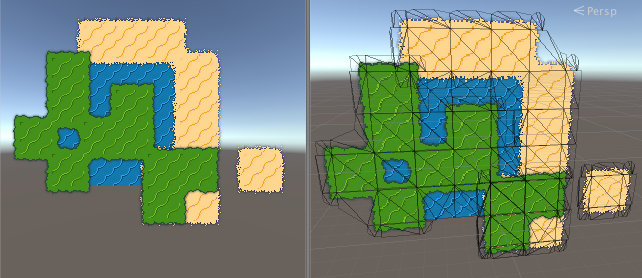

# zak
An attempt at creating a relatively simple and straight forward tilemap implementation in Unity 5.

## Features
- In editor support for creating tilemaps.
- Supports transition tiles and corner tiles.

## Flaws
- Everything is built in the editor and doesn't support external formats.
- All tiles, transitions and corner tiles are individual game objects so it's too heavy for large tile maps.

[Video example](https://www.youtube.com/watch?v=Ca1R_lOVwSc)
